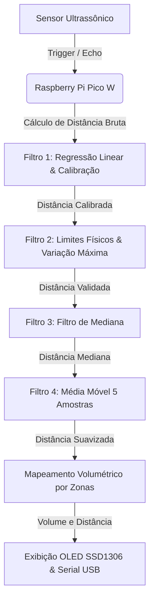

# Sistema de Medição de Nível e Volume por Ultrassom (Raspberry Pi Pico W)

Este repositório contém o firmware em C para monitoramento de nível e volume de líquido (leite) em tanques de armazenamento industriais de até 550 Litros. O sistema foi desenvolvido para a placa **Raspberry Pi Pico W**, utilizando o SDK oficial C/C++ da Raspberry Pi, um sensor de distância ultrassônico e um display OLED SSD1306.

---

## 📋 Sumário
1. [Visão Geral do Sistema](#1-visão-geral-do-sistema)
2. [Especificações de Hardware](#2-especificações-de-hardware)
   - [Mapeamento de Pinos (Pinout)](#mapeamento-de-pinos-pinout)
   - [Circuito do Echo (Divisor de Tensão)](#circuito-do-echo-divisor-de-tensão)
3. [Arquitetura de Firmware e Algoritmos](#3-arquitetura-de-firmware-e-algoritmos)
   - [Medição de Tempo e Distância Bruta](#medição-de-tempo-e-distância-bruta)
   - [Modelo de Calibração (Regressão Linear)](#modelo-de-calibração-regressão-linear)
   - [Pipeline de Filtragem e Tratamento de Ruído](#pipeline-de-filtragem-e-tratamento-de-ruído)
   - [Cálculo do Volume (Geometria Irregular por Zonas)](#cálculo-do-volume-geometria-irregular-por-zonas)
4. [Interface com o Usuário e Diagnóstico](#4-interface-com-o-usuário-e-diagnóstico)
   - [Exibição no OLED](#exibição-no-oled)
   - [Telemetria via Serial USB](#telemetria-via-serial-usb)
   - [Tratamento de Falhas do Sensor](#tratamento-de-falhas-do-sensor)
5. [Como Compilar e Executar](#5-como-compilar-e-executar)

---

## 1. Visão Geral do Sistema

O sistema mede continuamente a distância entre o sensor ultrassônico (instalado no topo do tanque) e a superfície do leite. A partir dessa medida, calcula a altura do líquido e interpola linearmente o volume equivalente em litros com base na curva geométrica real do tanque (que possui chanfros e inclinações). Os resultados são exibidos localmente em uma tela OLED e transmitidos via porta serial USB.



---

## 2. Especificações de Hardware

O firmware está configurado para interagir com os periféricos do Raspberry Pi Pico W através dos seguintes pinos de GPIO:

### Mapeamento de Pinos (Pinout)

| Periférico | Sinal | Pino GPIO (Pico W) | Tipo | Configuração Adicional |
| :--- | :--- | :--- | :--- | :--- |
| **Sensor Ultrassônico** | `TRIG_PIN` | **GPIO 9** | Saída | Digital |
| **Sensor Ultrassônico** | `ECHO_PIN` | **GPIO 8** | Entrada | Digital |
| **Display OLED SSD1306**| `SDA` | **GPIO 14** | E/S | I2C1 (Pull-up Interno) |
| **Display OLED SSD1306**| `SCL` | **GPIO 15** | Entrada | I2C1 (Pull-up Interno) |

* O barramento I2C utilizado é o **`i2c1`** rodando na velocidade de **400 kHz** (Fast Mode).
* O endereço I2C do display SSD1306 é **`0x3C`**.

### Circuito do Echo (Divisor de Tensão)

> [!WARNING]
> Sensores ultrassônicos costumam operar com alimentação e níveis de sinal de **5V**. O Raspberry Pi Pico opera com nível lógico máximo de **3.3V** em suas GPIOs. Conectar o pino `ECHO` diretamente ao GPIO 8 sem proteção pode danificar o microcontrolador de forma permanente. Atualmente, quando a placa está sendo alimentada pela USB, conectamos o sensor na saída de 3.3V da BitDog, quando a placa está só na bateria, conectamos o sensor na saída de 5V da BitDog.
---

## 3. Arquitetura de Firmware e Algoritmos

### Medição de Tempo e Distância Bruta

1. Um pulso de disparo (`TRIG`) de **10 µs** em nível lógico HIGH é emitido pelo Raspberry Pi Pico.
2. O sensor responde transmitindo uma rajada de 8 pulsos de ultrassom de 40 kHz e coloca o pino `ECHO` em nível lógico HIGH.
3. O firmware monitora a transição e a duração do pino `ECHO` em nível alto. A largura do pulso é medida utilizando temporizadores de alta precisão do SDK do Pico (`absolute_time_t` e `absolute_time_diff_us`).
4. Para garantir a robustez do firmware, existe uma proteção de timeout de **30 ms** (`ECHO_TIMEOUT_US = 30000`). Se o sensor não responder dentro desse período (por exemplo, devido a um obstáculo muito distante ou ausente), a medição retorna um código de erro (`-1.0f`).
5. A distância bruta em centímetros é calculada pela fórmula clássica, utilizando a velocidade aproximada do som no ar ($v = 343 \text{ m/s}$ ou $0.0343 \text{ cm/µs}$):
   
$$\text{distância} = \frac{\Delta t \times 0.0343}{2}$$

### Modelo de Calibração (Regressão Linear)

Para mitigar desvios de medição sistemáticos, causados por limitações físicas do sensor e variações ambientais, aplica-se uma fórmula matemática obtida através de análise de calibração por regressão linear:

$$\text{distância\_calibrada} = 1.100413 \times \text{distância\_bruta} - 2.17$$

### Pipeline de Filtragem e Tratamento de Ruído

A superfície de fluidos industriais pode apresentar ondulações, bolhas ou vapor, o que gera picos de leituras incorretas (ruídos). Para estabilizar os dados, a medição passa por um pipeline de três filtros sequenciais antes do cálculo de volume:

1. **Filtro de Limites e Variação Máxima (`filtrar_e_validar`)**:
   * Descarta leituras fisicamente impossíveis para a aplicação (menores que **2.0 cm** ou maiores que **100.0 cm**).
   * Restringe a variação máxima permitida a **$\pm$ 7.0 cm** por ciclo de amostragem (1 segundo). Se houver um salto repentino maior do que esse valor, a leitura é artificialmente contida no limite da taxa de variação. Isso evita perturbações causadas por agitações rápidas do líquido.
2. **Filtro de Mediana (`calcular_mediana`)**:
   * Armazena as últimas **5 leituras** em um buffer circular.
   * Ordena os dados temporariamente usando o algoritmo *Bubble Sort* e seleciona o elemento central (mediana).
   * Este filtro é altamente eficaz na eliminação de *outliers* (picos de ruídos espúrios isolados).
3. **Média Móvel (`calcular_media_movel`)**:
   * Calcula a média aritmética simples das últimas **5 leituras** processadas pelo filtro de mediana.
   * Amortece flutuações de alta frequência e suaviza oscilações térmicas residuais, fornecendo uma leitura final de distância extremamente estável.

---

### Cálculo do Volume (Geometria Irregular por Zonas)

O tanque de leite possui uma geometria industrial com formato irregular, composto por uma inclinação de fundo, canaleta de escoamento central e chanfros laterais. O sensor está fixado na tampa superior a uma **altura de referência de 78.0 cm** em relação ao ponto zero (fundo do tanque).

* **Capacidade Máxima Útil:** 550 Litros.
* **Altura Máxima Útil do Leite:** 57.5 cm (o que equivale a uma distância livre mínima de 20.5 cm entre a superfície do líquido e o sensor).
* **Zona Morta do Sensor:** Devido a limitações físicas da zona morta de proximidade do sensor ultrassônico, distâncias de leitura $\le 21.0 \text{ cm}$ são fixadas em $20.5 \text{ cm}$, forçando o volume à capacidade máxima de 550 Litros.

A altura instantânea do leite é calculada por:

$$\text{altura\_leite} = 78.0 \text{ cm} - \text{distância\_suavizada}$$

Com a altura calibrada, o volume (em mililitros) é determinado através de **interpolação linear por zonas**:

```mermaid
gantt
    title Divisão de Zonas Volumétricas do Tanque
    dateFormat  X
    axisFormat %s cm
    
    section ZONA 1 (Canal/Fundo)
    0.0 a 24.0 cm        :active, 0, 24
    
    section ZONA 2 (Transição)
    24.0 a 26.37 cm      :crit, 24, 26
    
    section ZONA 3 (Chanfro)
    26.37 a 57.5 cm      :active, 26, 58
```



#### 📏 Equações de Cálculo do Volume por Zona:

* **Zona 1 (0.0 cm a 24.0 cm):** Canal central e inclinação inferior do fundo. O volume cresce à taxa de $9.47916 \text{ L/cm}$.
  $$\text{Volume (mL)} = 9479.16 \times \text{altura\_leite}$$

* **Zona 2 (24.0 cm a 26.37 cm):** Início do chanfro lateral do tanque até a marca de calibragem de 250 Litros.
  $$\text{Volume (mL)} = 227500.0 + 9493.67 \times (\text{altura\_leite} - 24.0)$$

* **Zona 3 (26.37 cm a 57.5 cm):** Expansão superior do chanfro do tanque até o limite de 550 Litros. O volume cresce mais rápido devido ao volume extra das laterais chanfradas ($9.637 \text{ L/cm}$).
  $$\text{Volume (mL)} = 250000.0 + 9637.00 \times (\text{altura\_leite} - 26.37)$$

* **Capacidade Máxima:** Caso a altura calculada ultrapasse os 57.5 cm, o volume é fixado em **550 Litros (550.000 mL)** por motivos de segurança.

---

## 4. Interface com o Usuário e Diagnóstico

### Exibição no OLED
A tela OLED SSD1306 é atualizada a cada 1 segundo com três informações principais:
1. **`Bruta`**: Distância em tempo real aferida diretamente pelo sensor (sem processamento).
2. **`Suave`**: Distância final estabilizada após a aplicação da calibração e do pipeline de filtros.
3. **`Vol`**: Volume acumulado no tanque em **Litros (L)** com precisão de uma casa decimal.

### Telemetria via Serial USB
A telemetria de desenvolvimento é enviada via UART nativa do Pico emulada sobre a porta USB (`pico_enable_stdio_usb(1)`). A cada ciclo de medição (1 segundo), duas linhas de logs são transmitidas para a porta serial:

```text
Bruta: 35.20 cm | Calibrada: 36.55 cm | Mediana: 36.55 cm | Média: 36.55 cm
Volume: 147.24 L
```

### Tratamento de Falhas do Sensor
Se o sensor parar de responder por qualquer motivo físico (como cabos desconectados ou falha de hardware), a função de leitura retornará erros sucessivos. 
* Ao atingir **3 falhas consecutivas**, o firmware entra em modo de segurança:
  * Exibe na tela OLED a mensagem de erro centralizada: **`Sensor sem resposta`**.
  * Imprime um aviso de erro na serial de telemetria.
  * **Invalida os buffers dos filtros** (`buffer_inicializado = false` e `hist_mediana_inicializado = false`).
* Quando a conexão do sensor for restabelecida, o sistema volta a funcionar de forma transparente, reiniciando a coleta das amostras do zero para evitar contaminação do histórico de dados por leituras corrompidas.

---

## 5. Como Compilar e Executar

Este projeto foi construído para ser compilado utilizando a infraestrutura do **Pico SDK 2.2.0** e suporte ao gerador de compilação CMake.

### Pré-requisitos
* **Raspberry Pi Pico SDK** instalado no sistema.
* Ferramentas de compilação C/C++ (`arm-none-eabi-gcc`, `CMake`, `Make` ou `Ninja`).
* Recomendado: Extensão oficial do **Raspberry Pi Pico para VS Code**.

### Passos de Compilação (Via Terminal)

1. Crie e acesse um diretório para compilação:
   ```bash
   mkdir build
   cd build
   ```

2. Inicialize as configurações de compilação do CMake. O arquivo [CMakeLists.txt](file:///c:/Users/lucas/Desktop/desafio20.a_hardware-code_development/desafio20.a_hardware-code_development/sensor_ultrassonico/CMakeLists.txt) já está pré-configurado para a placa `pico_w`:
   ```bash
   cmake ..
   ```

3. Compile o código:
   ```bash
   make
   ```
   *(ou `ninja` / `cmake --build .` dependendo do seu gerador configurado)*.

4. Ao final do build, serão gerados os arquivos de execução no diretório `build`. O arquivo binário principal será o **`sensor_ultrassonico.uf2`**.

### Gravando no Raspberry Pi Pico
1. Desconecte o Raspberry Pi Pico do computador.
2. Pressione e segure o botão **BOOTSEL** localizado na placa.
3. Com o botão pressionado, reconecte o Pico à porta USB do seu computador. Ele aparecerá no sistema operacional como um dispositivo de armazenamento USB removível com o nome `RPI-RP2`.
4. Copie/Arraste o arquivo **`sensor_ultrassonico.uf2`** para dentro desta pasta do Pico.
5. A placa reiniciará automaticamente e iniciará a execução do firmware imediatamente.
